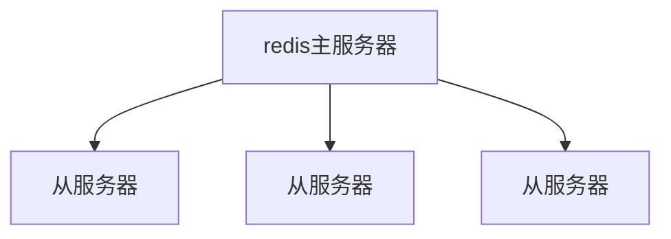

GitHub这里有压缩包 `https://github.com/zkteco-home/redis-windows`
解压Redis压缩包

启动Redis服务

```sh
redis-server.exe redis.windows.conf
```

随后使用`redis-server.exe redis.windows.conf`命令来启动redis服务：

在环境配置里配置redis安装路径配置

cmd打开Redis客户端进行连接

我们使用`redis-cli.exe`命令来打开Redis客户端：

```sh
redis-cli.exe -h 127.0.0.1 -p 6379
```

原来的窗口不要关闭


## redis基本使用

### 字符串的操作

```sh
SET key value [NX|XX] [EX seconds] [PX milliseconds] [GET]
```

`key`：要设置的键名。

`value`：要设置的值。

`NX`：可选参数，表示只在键不存在时才设置值。

`XX`：可选参数，表示只在键已经存在时才设置值。

`EX seconds`：可选参数，将键的过期时间设置为指定的秒数。

`PX milliseconds`：可选参数，将键的过期时间设置为指定的毫秒数。

`GET`：可选参数，返回键的旧值。

1.设置键名为 "name" 的值为 "John"：

```sh
SET name "John"
```

2.设置键名为 "counter" 的值为 10，并设置过期时间为 60 秒：

```sh
SET counter 10 EX 60
```

3.只在键名为 "status" 不存在时，设置其值为 "active"：

```sh
SET status "active" NX
```

4.只在键名为 "score" 已经存在时，将其值增加 5：

```sh
SET score 5 XX
```

5.设置键名为 "message" 的值为 "Hello"，并返回旧的值：

```sh
SET message "Hello" GET
```

6.删除键名为 "name" 的键：

```sh
DEL name
```

7.批量删除多个键名：

```sh
DEL key1 key2 key3
```

8.删除不存在的键名，不会报错，返回删除的键数量为 0：

```sh
DEL non_existing_key
```

### 集合的操作

集合（Set）是一种无序且不重复的数据结构，用于存储一组独立的元素。集合中的元素之间没有明确的顺序关系，每个元素在集合中只能出现一次。

1、添加成员到集合：

```sh
SADD fruits "apple"
SADD fruits "banana"
SADD fruits "orange"
```

2、获取集合中的所有成员：

```sh
SMEMBERS fruits
```

3、检查成员是否存在于集合中：

```sh
SISMEMBER fruits "apple"
```

输出结果：

```sh
(integer) 1
```

4、从集合中移除成员：

```sh
SREM fruits "banana"
```

输出结果：

```sh
(integer) 1
```

5、获取集合中的成员数量：

```sh
SCARD fruits
```

输出结果：

```sh
(integer) 2
```

6、获取随机成员：

```sh
SRANDMEMBER fruits
```

输出结果：

```sh
"apple"
```

7、求多个集合的并集：

```sh
SUNION fruits vegetables
```

输出结果：

```sh
1) "apple"
2) "orange"
3) "tomato"
4) "carrot"
```

8、求多个集合的交集：

```sh
SINTER fruits vegetables
```

输出结果：

```sh
"apple"
```

9、求多个集合的差集：

```
SDIFF fruits vegetables
```

输出结果：

```sh
"orange"
```

### 哈希表操作

哈希表（Hash）是一种数据结构，也称为字典、关联数组或映射，用于存储键值对集合。在哈希表中，键和值都是存储的数据项，并通过哈希函数将键映射到特定的存储位置，从而实现快速的数据访问和查找。

1、设置哈希表中的字段值：

```sh
HSET obj name "John"
HSET obj age 25 //也可以用于修改
HSET obj email "john@example.com"
```

2、获取哈希表中的字段值：

```sh
HGET obj name
```

输出结果：

```sh
"John"
```

3、一次设置多个字段的值：

```sh
HMSET obj name "John" age 25 email "john@example.com"
```

4、从集合中移除成员：

```sh
HMGET obj name age email
```

输出结果：

```sh
1) "John"
2) "25"
3) "john@example.com"
```

5、获取集合中的成员数量：

```sh
HGETALL obj
```

输出结果：

```sh
1) "name"
2) "John"
3) "age"
4) "25"
5) "email"
6) "john@example.com"
```

6、删除哈希表中的字段：

```sh
HDEL obj age email
```

输出结果：

```sh
(integer) 2
```

7、检查哈希表中是否存在指定字段：

```sh
HEXISTS obj name
```

输出结果：

```sh
(integer) 1
```

8、获取哈希表中所有的字段：

```sh
HKEYS obj
```

输出结果：

```sh
1) "name"
```

9、求多个集合的差集：

```
HVALS obj
```

输出结果：

```sh
1) "John"
```

10、求多个集合的差集：

```
HLEN obj
```

输出结果：

```sh
(integer) 1
```

### 列表的操作

列表（List）是一种有序、可变且可重复的数据结构。在许多编程语言和数据存储系统中，列表是一种常见的数据结构类型，用于存储一组元素

1、添加元素：

```sh
RPUSH key element1 element2 element3  // 将元素从右侧插入列表
LPUSH key element1 element2 element3  // 将元素从左侧插入列表
```

> `LPUSH key element1 element2 ...`：将一个或多个元素从列表的左侧插入，即将元素依次插入列表的`头部`。如果列表不存在，则在执行操作前会自动创建一个新的列表。
>
> `RPUSH key element1 element2 ...`：将一个或多个元素从列表的右侧插入，即将元素依次插入列表的`尾部`。如果列表不存在，则在执行操作前会自动创建一个新的列表。

2、获取元素：

```sh
LINDEX key index  // 获取列表中指定索引位置的元素
LRANGE key start stop  // 获取列表中指定范围内的元素

lrange list 0 -1
1) "z"
2) "y"
3) "x"
4) "1"
5) "2"
6) "3"
lrange list 0 -3
1) "z"
2) "y"
3) "x"
4) "1"
```

3、修改元素：

```sh
LSET key index newValue  // 修改列表中指定索引位置的元素的值
```

4、删除元素：

```sh
LPOP key  // 从列表的左侧移除并返回第一个元素
RPOP key  // 从列表的右侧移除并返回最后一个元素
LREM key count value  // 从列表中删除指定数量(count)的指定值元素
```

5、获取列表长度：

```sh
LLEN key  // 获取列表的长度
```

### 发布订阅

发布-订阅是一种消息传递模式，其中消息发布者（发布者）将消息发送到频道（channel），而订阅者（订阅者）可以订阅一个或多个频道以接收消息。这种模式允许消息的解耦，发布者和订阅者之间可以独立操作，不需要直接交互。

在Redis中，发布-订阅模式通过以下命令进行操作：

1. PUBLISH命令：用于将消息发布到指定的频道。语法为：PUBLISH channel message。例如，PUBLISH news "Hello, world!" 将消息"Hello, world!"发布到名为"news"的频道。
2. SUBSCRIBE命令：用于订阅一个或多个频道。语法为：SUBSCRIBE channel [channel ...]。例如，SUBSCRIBE news sports 订阅了名为"news"和"sports"的频道。
3. UNSUBSCRIBE命令：用于取消订阅一个或多个频道。语法为：UNSUBSCRIBE [channel [channel ...]]。例如，UNSUBSCRIBE news 取消订阅名为"news"的频道。
4. PSUBSCRIBE命令：用于模式订阅一个或多个匹配的频道。语法为：PSUBSCRIBE pattern [pattern ...]。其中，pattern可以包含通配符。例如，PSUBSCRIBE news.* 订阅了以"news."开头的所有频道。
5. PUNSUBSCRIBE命令：用于取消模式订阅一个或多个匹配的频道。语法为：PUNSUBSCRIBE [pattern [pattern ...]]。例如，PUNSUBSCRIBE news.* 取消订阅以"news."开头的所有频道。

### 事务

Redis支持事务（Transaction），它允许用户将多个命令打包在一起作为一个单元进行执行。事务提供了一种原子性操作的机制，要么所有的命令都执行成功，要么所有的命令都不执行。

Redis的事务使用MULTI、EXEC、WATCH和DISCARD等命令来管理。

1. MULTI命令：用于开启一个事务。在执行MULTI命令后，Redis会将接下来的命令都添加到事务队列中，而不是立即执行。
2. EXEC命令：用于执行事务中的所有命令。当执行EXEC命令时，Redis会按照事务队列中的顺序执行所有的命令。执行结果以数组的形式返回给客户端。
3. WATCH命令：用于对一个或多个键进行监视。如果在事务执行之前，被监视的键被修改了，事务将被中断，不会执行。
4. DISCARD命令：用于取消事务。当执行DISCARD命令时，所有在事务队列中的命令都会被清空，事务被取消。

使用事务的基本流程如下：

1. 使用MULTI命令开启一个事务。
2. 将需要执行的命令添加到事务队列中。
3. 如果需要，使用WATCH命令监视键。
4. 执行EXEC命令执行事务。Redis会按照队列中的顺序执行命令，并返回执行结果。
5. 根据返回结果判断事务执行是否成功。

事务中的命令在执行之前不会立即执行，而是在执行EXEC命令时才会被执行。这意味着事务期间的命令并不会阻塞其他客户端的操作，也不会中断其他客户端对键的读写操作。

需要注意的是，`Redis的事务不支持回滚操作`。如果在事务执行期间发生错误，事务会继续执行，而不会回滚已执行的命令。因此，在使用Redis事务时，需要保证事务中的命令是幂等的，即多次执行命令的结果和一次执行的结果相同

```sh
# 连接Redis
redis-cli

# 开启事务
MULTI

# 添加命令到事务队列
SET key1 value1
GET key2

# 执行事务
EXEC
```

### redis持久化

Redis提供两种持久化方式：

1. RDB（Redis Database）持久化：RDB是一种快照的形式，它会将内存中的数据定期保存到磁盘上。可以通过配置Redis服务器，设置自动触发RDB快照的条件，比如在指定的时间间隔内，或者在指定的写操作次数达到一定阈值时进行快照保存。RDB持久化生成的快照文件是一个二进制文件，包含了Redis数据的完整状态。在恢复数据时，可以通过加载快照文件将数据重新加载到内存中。
2. AOF（Append-Only File）持久化：AOF持久化记录了Redis服务器执行的所有写操作命令，在文件中以追加的方式保存。当Redis需要重启时，可以重新执行AOF文件中保存的命令，以重新构建数据集。相比于RDB持久化，AOF持久化提供了更好的数据恢复保证，因为它记录了每个写操作，而不是快照的形式。然而，AOF文件相对于RDB文件更大，恢复数据的速度可能会比较慢。

### RDB使用

打开redis配置文件

redis.windows.conf或redis.conf
找到save

他提供了三个案例

1. 3600秒内也就是一小时进行一次改动就会触发快照
2. 300秒内也就是5分钟，进行100次修改就会进行快照
3. 60秒内一万次修改就会进行快照

具体场景需要根据你的用户量，以及负载情况自己定义.

其次就是可以通过命令行手动触发快照

```sh
save
```

### AOF使用

将 `appendonly` 配置项的值设置为 `yes`：默认情况下，该配置项的值为 `no`，表示未启用AOF持久化。将其值修改为 `yes`，以启用AOF持久化。

### redis主从复制

Redis主从复制是一种数据复制和同步机制，其中一个Redis服务器（称为主服务器）将其数据复制到一个或多个其他Redis服务器（称为从服务器）。主从复制提供了数据冗余备份、读写分离和故障恢复等功能。



以下是Redis主从复制的一般工作流程：

1. 配置主服务器：在主服务器上，你需要在配置文件中启用主从复制并指定从服务器的IP地址和端口号。你可以使用`replicaof`配置选项或`slaveof`配置选项来指定从服务器。
2. 连接从服务器：从服务器连接到主服务器并发送复制请求。从服务器通过发送`SYNC`命令请求进行全量复制或通过发送`PSYNC`命令请求进行部分复制（增量复制）。
3. 全量复制（SYNC）：如果从服务器是第一次连接或无法执行部分复制，主服务器将执行全量复制。在全量复制期间，主服务器将快照文件（RDB文件）发送给从服务器，从服务器将接收并加载该文件以完全复制主服务器的数据。
4. 部分复制（PSYNC）：如果从服务器已经执行过全量复制并建立了复制断点，主服务器将执行部分复制。在部分复制期间，主服务器将发送增量复制流（replication stream）给从服务器，从服务器将接收并应用该流以保持与主服务器的同步。
5. 复制持久化：从服务器接收到数据后，会将其保存在本地磁盘上，以便在重启后仍然保持数据的一致性。
6. 同步延迟：从服务器的复制是异步的，因此存在复制延迟。延迟取决于网络延迟、主服务器的负载和从服务器的性能等因素。
7. 读写分离：一旦建立了主从复制关系，从服务器可以接收读操作。这使得可以将读流量从主服务器分散到从服务器上，从而减轻主服务器的负载。
8. 故障恢复：如果主服务器发生故障，可以将一个从服务器提升为新的主服务器，以继续提供服务。当主服务器恢复时，它可以作为从服务器连接到新的主服务器，继续进行数据复制。

### 修改配置文件

在根目录下面新建一个 redis-6378.conf 配置文件 作为redis`从服务器`,默认的配置文件6379作为`主服务器`

redis-6378.conf 文件配置

```conf
bind 127.0.0.1 #ip地址
port 6378 #端口号
daemonize yes #守护线程静默运行
replicaof 127.0.0.1 6379 #指定主服务器
```

启动从服务器

```sh
redis-server ./redis-6378.conf 指定配置文件
```

打开从服务器cli

```sh
redis-cli -p 6378
```

启动主服务器

```sh
redis-cli 直接启动默认就是主服务器的配置文件
```

主服务器写入一个值

```sh
set master 2
```

从服务器直接同步过来这个值 就可以直接获取到
