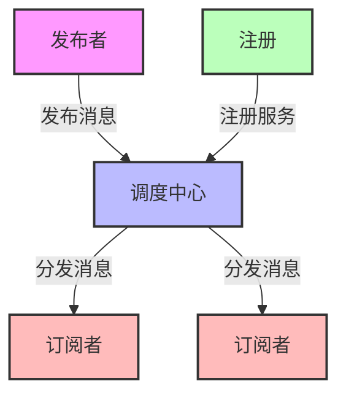

## 学习TypeScript

### 认识基础类型

下载组件库

```sh
npm install typescript -g
```

创建一个ts文件并且初始化`tsc --init` ,在执行`tsc -w`

创建文件：

1.tsc file’s name -w :监听ts文件生成为js文件

2.node file's name 编译js文件

类型：

1.基础类型：Boolean、Number、underfine、null、String、Symbol、BigInt

严格模式配置文件（tsconfig)；

```typescript
{
    "compilerOptions":{
      "strict": true //严格模式的开启和关闭
    }
}
```

### 任意类型

安装组件库

```sh
npm i @types/node --save-dev
npm i ts-node --g
// 安装tsx可以直接运行
npm install -g tsx
tsx file.ts
```

1、any 任意类型 unknown 不知道类型 ->属于顶级类型

2、Object

3、Number String Boolean

4、Number String Boolean

5、1........... '小白' .........true

6、never

### 接口和对象类型

```typescript
// interface 重名 重合
// interface 任意key [propName:string]:any索引签名
// interface ? 可选 readonly 只读
// interface 接口继承 extends
// interface 定义函数类型
//不能多属性 也不能少属性


interface Axx extends Bx {
    readonly id: number
    name: string
    age?: number
    readonly cb: () => boolean
}

interface Bx {
    xxx: string
}

let a: Axx = {
    id: 1,
    name: "小白",
    age: 88,
    xxx: 'xxx',
    cb: () => {
        return false
    }
}
console.log(a)

interface Fn {
    (name:string):number[]
}

const fn:Fn = function (name:string) {
    return [1]
}
```

### 数组类型

```typescript
//number[]
//Array<boolean>
//定义数组
interface X {
    name: string
    age?: number
}
let arr: X[] = [{ name: '小白' }, { name: '小青', age: 12 }]
// 定义对象数组使用interface
```

```ts
//二维数组
// let arr: number[][] = [[1, 2], [3, 4]]
// Array<Array<number>>
// any[]
// 大小不确定的数组
// let arr: any[] = [1, '2', true, {}, []]
let arr: number[][] = [[], []]

console.log(arr)
```

```typescript
function a(...args: string[]) {
    console.log(args)
}

a('1', '2', '3', '4')
```

### 函数类型

函数定义类型和返回值|箭头函数定义类型和返回值

```typescript
function add(a: number, b: number): number {
    return a + b;
}

const subtract = (a: number, b: number): number => {
    return a - b;
}
console.log(add(2, 3)); // Output: 5
console.log(subtract(5, 2)); // Output: 3
```

函数默认的参数|函数可选参数

```typescript
function add(a: number = 10, b: number): number {
    return a + b;
}
//可选
function add(a: number, b?: number): number {
    return a + b; //NaN
}
```

参数是一个对象如何定义

```typescript
interface Person {
  name: string;
  age: number;
}

function greet(person: Person): string {
  return `Hello, ${person.name}! You are ${person.age} years old.`;
}

console.log(greet({ name: "Alice", age: 30 }));
```

函数this类型，函数重载

```typescript
interface Obj {
    user: number[],
    add: (this: Obj, num: number) => void
}
// ts 可以定义this的类型 在js中无法使用 必须是第一个参数定义this的类型
let obj:Obj = {
    user:[1,2,3],
    add(this:Obj,num:number) {
        this.user.push(num)
    }
}

obj.add(4)
console.log(obj)
```

```typescript
// 函数重载
let user: number[] = [1, 2, 3]
function findNum(add: number[]): number[] //如果传入一个number类型的数组 就把这个数组添加到user中
function findNum(id: number): number[] //如果传递了id就是单个查询
function findNum(): number[]  //如果没有传入东西就是查询所有
function findNum(ids?: number | number[]): number[] {
    if (typeof ids === 'number') {
        return user.filter(item => item === ids)
    }
    else if (Array.isArray(ids)) {
        user.push(...ids)
        return user
    } else {
        return user
    }
}

console.log(findNum()) //查询所有
console.log(findNum(2)) //查询单个
console.log(findNum([4, 5])) //添加数组
```

### 类型断言 | 联合类型 | 交叉类型

```typescript
//联合类型
let phone:number | string = 3123709
let phone:number | string = '090-123535'
console.log(phone)

let fn = function(type:number|boolean):boolean {
    return !!type
}

let result = fn(1)
console.log(result)
```

```typescript
// 交叉类型
interface Pople {
    name: string
    age: number
}

interface Man {
    sex: number
}
const xiaobai = (man: Pople & Man): void => {
    console.log(man);
}
xiaobai({
    name: '小白',
    age: 10,
    sex: 1
})
```

```typescript
// 类型断言-只能欺骗编译器但是不能防止报错-不能滥用
let fn = function(num:number | string):void {
    console.log((num as string).length)
}

fn(2138)
```

### 内置对象

**ECMAScript的内置对象有: Boolean、Number、String、RegExp、Date、Error**

```typescript
let b: Boolean = new Boolean(1)
console.log(b)
let n: Number = new Number(true)
console.log(n)
let s: String = new String('哔哩哔哩关注小满zs')
console.log(s)
let d: Date = new Date()
console.log(d)
let r: RegExp = /^1/
console.log(r)
let e: Error = new Error("error!")
console.log(e)
```

**DOM和BOM的内置对象有: **`Document`、`HTMLElement`、`Event`、`NodeList`  **等**

```typescript
let body: HTMLElement = document.body;
let allDiv: NodeList = document.querySelectorAll('div');
//读取div 这种需要类型断言 或者加个判断应为读不到返回null
let div:HTMLElement = document.querySelector('div') as HTMLDivElement
document.addEventListener('click', function (e: MouseEvent) {
    
});
//dom元素的映射表
interface HTMLElementTagNameMap {
    "a": HTMLAnchorElement;
    "abbr": HTMLElement;
    "address": HTMLElement;
    "applet": HTMLAppletElement;
    "area": HTMLAreaElement;
    "article": HTMLElement;
    "aside": HTMLElement;
    "audio": HTMLAudioElement;
    "b": HTMLElement;
    "base": HTMLBaseElement;
    "bdi": HTMLElement;
    "bdo": HTMLElement;
    "blockquote": HTMLQuoteElement;
    "body": HTMLBodyElement;
    "br": HTMLBRElement;
    "button": HTMLButtonElement;
    "canvas": HTMLCanvasElement;
    "caption": HTMLTableCaptionElement;
    "cite": HTMLElement;
    "code": HTMLElement;
    "col": HTMLTableColElement;
    "colgroup": HTMLTableColElement;
    "data": HTMLDataElement;
    "datalist": HTMLDataListElement;
    "dd": HTMLElement;
    "del": HTMLModElement;
    "details": HTMLDetailsElement;
    "dfn": HTMLElement;
    "dialog": HTMLDialogElement;
    "dir": HTMLDirectoryElement;
    "div": HTMLDivElement;
    "dl": HTMLDListElement;
    "dt": HTMLElement;
    "em": HTMLElement;
    "embed": HTMLEmbedElement;
    "fieldset": HTMLFieldSetElement;
    "figcaption": HTMLElement;
    "figure": HTMLElement;
    "font": HTMLFontElement;
    "footer": HTMLElement;
    "form": HTMLFormElement;
    "frame": HTMLFrameElement;
    "frameset": HTMLFrameSetElement;
    "h1": HTMLHeadingElement;
    "h2": HTMLHeadingElement;
    "h3": HTMLHeadingElement;
    "h4": HTMLHeadingElement;
    "h5": HTMLHeadingElement;
    "h6": HTMLHeadingElement;
    "head": HTMLHeadElement;
    "header": HTMLElement;
    "hgroup": HTMLElement;
    "hr": HTMLHRElement;
    "html": HTMLHtmlElement;
    "i": HTMLElement;
    "iframe": HTMLIFrameElement;
    "img": HTMLImageElement;
    "input": HTMLInputElement;
    "ins": HTMLModElement;
    "kbd": HTMLElement;
    "label": HTMLLabelElement;
    "legend": HTMLLegendElement;
    "li": HTMLLIElement;
    "link": HTMLLinkElement;
    "main": HTMLElement;
    "map": HTMLMapElement;
    "mark": HTMLElement;
    "marquee": HTMLMarqueeElement;
    "menu": HTMLMenuElement;
    "meta": HTMLMetaElement;
    "meter": HTMLMeterElement;
    "nav": HTMLElement;
    "noscript": HTMLElement;
    "object": HTMLObjectElement;
    "ol": HTMLOListElement;
    "optgroup": HTMLOptGroupElement;
    "option": HTMLOptionElement;
    "output": HTMLOutputElement;
    "p": HTMLParagraphElement;
    "param": HTMLParamElement;
    "picture": HTMLPictureElement;
    "pre": HTMLPreElement;
    "progress": HTMLProgressElement;
    "q": HTMLQuoteElement;
    "rp": HTMLElement;
    "rt": HTMLElement;
    "ruby": HTMLElement;
    "s": HTMLElement;
    "samp": HTMLElement;
    "script": HTMLScriptElement;
    "section": HTMLElement;
    "select": HTMLSelectElement;
    "slot": HTMLSlotElement;
    "small": HTMLElement;
    "source": HTMLSourceElement;
    "span": HTMLSpanElement;
    "strong": HTMLElement;
    "style": HTMLStyleElement;
    "sub": HTMLElement;
    "summary": HTMLElement;
    "sup": HTMLElement;
    "table": HTMLTableElement;
    "tbody": HTMLTableSectionElement;
    "td": HTMLTableDataCellElement;
    "template": HTMLTemplateElement;
    "textarea": HTMLTextAreaElement;
    "tfoot": HTMLTableSectionElement;
    "th": HTMLTableHeaderCellElement;
    "thead": HTMLTableSectionElement;
    "time": HTMLTimeElement;
    "title": HTMLTitleElement;
    "tr": HTMLTableRowElement;
    "track": HTMLTrackElement;
    "u": HTMLElement;
    "ul": HTMLUListElement;
    "var": HTMLElement;
    "video": HTMLVideoElement;
    "wbr": HTMLElement;
}
```

**定义Promise 如果我们不知道返回的类型TS是推断不出来返回的是什么类型**

```typescript
function promise():Promise<number>{
   return new Promise<number>((resolve,reject)=>{
       resolve(1)
   })
}
 
promise().then(res=>{
    console.log(res)
})
```

代码雨

```typescript
let canvas = document.querySelector('#canvas') as HTMLCanvasElement
let ctx = canvas.getContext('2d') as CanvasRenderingContext2D
canvas.height = screen.availHeight; //可视区域的高度
canvas.width = screen.availWidth; //可视区域的宽度
let str: string[] = 'asmdamsdma'.split('') // 随意字母
let Arr = Array(Math.ceil(canvas.width / 10)).fill(0) //获取宽度例如1920 / 10 192
console.log(Arr);
 
const rain = () => {
    ctx.fillStyle = 'rgba(0,0,0,0.05)'//填充背景颜色
    ctx.fillRect(0, 0, canvas.width, canvas.height)//背景
    ctx.fillStyle = "#0f0"; //文字颜色
    Arr.forEach((item, index) => {
        ctx.fillText(str[ Math.floor(Math.random() * str.length) ], index * 10, item + 10)
        Arr[index] = item >= canvas.height || item > 10000 *  Math.random() ? 0 : item + 10; //添加随机数让字符随机出现不至于那么平整
    })
    console.log(Arr);
    
}
setInterval(rain, 40)
```

### class类

1. class 的基本用法 继承 和 类型约束

```ts
class Person {
    name: string;
    age: number;

    constructor(name: string, age: number) {
        this.name = name;
        this.age = age;
    }

    run() {
        console.log(`${this.name} is running`);
    }

    nameInfo() {
        console.log(`My name is ${this.name}, and I am ${this.age} years old.`);
    }
}

let person = new Person('Alice', 30);
person.run();
person.nameInfo();
```

2. class 的修饰符 readonly  protected private  public

```typescript
class Person {
    public name: string; // 使用public 修饰符 可以让你定义的变量 内部访问 也可以外部访问 如果不写默认就是public
    public age: number; // 使用public 修饰符 可以让你定义的变量 内部访问 也可以外部访问 如果不写默认就是public
    private secret: string = 'This is a secret'; // 使用private 修饰符 可以让你定义的变量 只能在类的内部访问 不能被子类访问 也不能被外部访问
    protected some: any; // 使用protected 修饰符 可以让你定义的变量 内部访问 但是外部无法访问 只能被子类访问

    constructor(name: string, age: number) {
        this.name = name;
        this.age = age;
    }

    run() {
        console.log(`${this.name} is running`);
    }

    nameInfo() {
        console.log(`My name is ${this.name}, and I am ${this.age} years old.`);
    }
}

let person = new Person('Alice', 30);
person.run();
person.nameInfo();
```

3. super 原理

```
class A {
    name: string
    constructor(name: string) {
        this.name = name
    }

    run() {
        console.log('run')
    }
}
class Person extends A {
	 constructor(name: string, asd: string) {
        super(name);
        super.run() //调用父类的方法
    }
}
```

4. 静态方法

一、我们用static 定义的属性 不可以通过this 去访问 只能通过类名去调用

二、static 静态函数 同样也是不能通过this 去调用 也是通过类名去调用

三、需注意： 如果两个函数都是static 静态的是可以通过this互相调用

```typescript
class Person {
    public name: string; // 使用public 修饰符 可以让你定义的变量 内部访问 也可以外部访问 如果不写默认就是public
    public age: number = 10; // 使用public 修饰符 可以让你定义的变量 内部访问 也可以外部访问 如果不写默认就是public
    private secret: string = 'This is a secret'; // 使用private 修饰符 可以让你定义的变量 只能在类的内部访问 不能被子类访问 也不能被外部访问
    protected some: any; // 使用protected 修饰符 可以让你定义的变量 内部访问 但是外部无法访问 只能被子类访问

    static info: string = 'This is a static property';

    constructor(name: string, age: number) {
        this.name = name;
        this.age = age;
        // this.info //不行, 对应上面的第一点
        // this.run() //不行, 对应上面第二点
    }

    static run() {
        // console.log(`${this.name} is running`);
        return this.nameInfo();
    }

    static nameInfo() {
        return `The name is ${this.name}`;
    }
}

let person = new Person('Alice', 30);
Person.info
console.log(Person.info) //访问静态属性
Person.run();
Person.nameInfo();
```

5. get set

```typescript
interface PersonClass {
    get(type: boolean): string | number
}

interface PersonClass2 {
    set(type: boolean, value: string | number): void,
    asd: string
}

class A {
    name: string
    constructor(name: string) {
        this.name = name
    }

    run() {
        console.log('run')
    }
}

class Person extends A implements PersonClass, PersonClass2 {
    asd: string
    constructor(name: string, asd: string) {
        super(name);
        super.run() //调用父类的方法
        console.log(this.name) //张三
        this.asd = asd;
    }
    get(type: boolean): string | number {
        if (type) {
            return this.name
        } else {
            return this.asd.length
        }
    }
    set(type: boolean, value: string | number): void {
        if (type) {
            this.name = value as string
        } else {
            this.asd = value as string
        }
    }
}

const person = new Person('张三', 'asd')
console.log(person.get(true)) //张三
console.log(person.get(false)) //3
```

抽象类

**不能直接实例化**

```typescript
abstract class Animal {
    abstract makeSound(): void;
    move(): void {
        console.log("Moving...");
    }
}

// 错误！不能直接实例化抽象类
// let animal = new Animal(); // 编译错误

// 正确！通过继承来使用
class Dog extends Animal {
    makeSound(): void {
        console.log("Woof!");
    }
}
let dog = new Dog(); // 正确
```

### 元组类型

```typescript
let arr: [number, string] = [1, '2'] //元组类型 可以指定数组中每个元素的类型和位置
// arr[0] = '1' //错误 因为第一个元素必须是number类型
arr[0] = 2 //正确
// 没有设置boolean类型的元素 但是可以使用push方法添加元素 因为元组类型是一个数组类型 可以使用数组的方法
// 会导致类型不安全 因为元组类型只能访问指定位置的元素 但是push方法可以添加任意类型的元素
arr.push(true) //元组类型可以使用push方法添加元素 但是不能使用索引访问新添加的元素 因为元组类型只能访问指定位置的元素
// console.log(arr[3]) //错误 因为索引3超出范围
console.log(arr) //正确 输出 [2, '2', true, 3]
```

**应用场景 例如定义excel返回数据**

```typescript
let excel: [string, string, number, string][] = [
    ['title', 'name', 1, '123'],
    ['title', 'name', 1, '123'],
    ['title', 'name', 1, '123'],
    ['title', 'name', 1, '123'],
    ['title', 'name', 1, '123'],
]
```

### 枚举类型

#### 数字枚举

```ts
enum Typs {
    Red,
    Green,
    Blue
}
// 默认是
enum Typs {
    Red = 0,
    Green = 1,
    Blue = 2
}
// 增长枚举就是将第一个枚举的值改成1
enum Typs {
    Red = 1,
    Green,
    Blue
}
// 其他成员会从1开始自动增长
```

#### 字符串枚举

```ts
enum Typs {
    Red = 'red',
    Green = 'green',
    Blue = 'blue'
}
```

#### 异构枚举

枚举可以混合字符串和数字

```ts
enum Typs {
	NO = 'No',
	Yes = 1
}
```

#### 接口枚举

定义一个枚举Types 定义一个接口A 他有一个属性red 值为Types.yyds

声明对象的时候要遵循这个规则

```ts
enum Types {
	yyds,
    dddd
}
interface A {
    red:Types.yyds
}
 
let obj:A = {
    red:Types.yyds
}
```

#### const枚举

let  和 var 都是不允许的声明只能使用const

大多数情况下，枚举是十分有效的 方案。 然而在某些情况下需求很严格。 为了避免在额外生成的代码上的开销和额外的非直接的对枚举成员的访问，我们可以使用 const枚举。 常量枚举通过在枚举上使用 const修饰符来定义

const 声明的枚举会被编译成常量

普通声明的枚举编译完后是个对象

```ts
const enum Typs2 {
    Red = 1,
    Green = 2,
    Blue = 4
}

console.log(Typs2.Red); // Output: 1
console.log(Typs2.Green); // Output: 2
console.log(Typs2.Blue); // Output: 4
```

**反向映射**

```ts
enum Typs {
    Red,
    Green,
    Blue
}

const color: Typs = Typs.Green;
console.log(color); // Output: 1

// 反向映射
const colorName: string = Typs[color] ?? "Unknown";
console.log(colorName); // Output: "Green"
```

### 什么是类型推论

```ts
// 1.我声明了一个变量但是没有定义类型
// TypeScript 会在没有明确的指定类型的时候推测出一个类型，这就是类型推论
let str = "是的分类"

//所以TS帮我推断出来这是一个string类型
str = 12316156 //赋值不了

console.log(str)
```

```ts
// 不能够在赋值给别的类型
// 2.如果你声明变量没有定义类型也没有赋值这时候TS会推断成any类型可以进行任何操作

let str

str = 'hello world'
str = 123
str = true

console.log(str)
```

#### 类型别名

type 关键字（可以给一个类型定义一个名字）多用于复合类型

 定义类型别名

```ts
type str = string
 
 
let s:str = "啊什么的了"
console.log(s);
```

定义函数别名

```typescript
type str = () => string;

let a: str = () => "Hello, World!";

console.log(a()); // 输出: Hello, World!
```

定义联合类型别名

```ts
type str2 = string | number;
let b: str2 = "Hello";
let c: str2 = 42;
console.log(b); // 输出: Hello
console.log(c); // 输出: 42
```

定义值的别名

```ts
type value = boolean | number | string | symbol | bigint | null | undefined;

// 交叉类型
let s: value = true
let n: value = 123
let str: value = 'hello'

console.log(s, n, str)
// ----------------------------------------------------------------------------
type value = boolean | 1 | string | symbol | bigint | null | undefined;

// 交叉类型
let s: value = true
let n: value = 1
let str: value = 'hello'

console.log(s, n, str)
```

type 和 interface 还是一些区别的 虽然都可以定义类型

1.interface可以继承  type 只能通过 & 交叉类型合并

2.type 可以定义 联合类型 和 可以使用一些操作符 interface不行

3.interface 遇到重名的会合并 type 不行

type高级用法

左边的值会作为右边值的子类型遵循图中上下的包含关系

```ts
// 1 extends number ? 1 : 0  // 结果是 1
// 1 是数字字面量类型，它可以赋值给 number 类型，所以返回 1
type a = 1 extends number ? 1 : 0; // 1

// 1 extends Number ? 1 : 0  // 结果是 1  
// Number 是包装对象类型，number 类型可以赋值给 Number 类型，所以返回 1
type b = 1 extends Number ? 1 : 0; // 1

// 1 extends Object ? 1 : 0  // 结果是 1
// Object 是所有对象类型的基类，在联合类型分配时会有特殊处理
type c = 1 extends Object ? 1 : 0; // 1

// 1 extends any ? 1 : 0  // 结果是 1
// any 类型可以接受任何类型，所以返回 1
type d = 1 extends any ? 1 : 0; // 1

// 1 extends unknown ? 1 : 0  // 结果是 1
// unknown 是顶级类型，所有类型都可以赋值给它，所以返回 1
type e = 1 extends unknown ? 1 : 0; // 1
 
// 1 extends never ? 1 : 0  // 结果是 0
// never 是一个没有值的类型，任何类型都不能赋值给 never，所以返回 0
type f = 1 extends never ? 1 : 0 //0
```

### never类型

```ts
// TypeScript 将使用 never 类 型来表示不应该存在的状态(很抽象是不是)
// 返回never的函数必须存在无法达到的终点

// 因为必定抛出异常，所以 error 将不会有返回值
function error(message: string): never {
    throw new Error(message);
}
// 睡眠函数，返回一个 Promise<void>，表示在指定时间后完成
function sleep(ms: number): Promise<void> {
    return new Promise(resolve => setTimeout(resolve, ms));
}
// 因为存在死循环，所以 loop 将不会有返回值
async function loop(): Promise<never> {
    while (true) {
        console.log("This will loop forever");
        await sleep(1000);
    }
}

// 返回 never 的函数必须存在无法达到的终点
function fail() {
    return error("Something failed");
}

// console.log(fail()); // 这里会抛出异常，永远不会有返回值
// console.log(loop()); // 这里会进入死循环，永远不会有返回值
```

#### never与void的差异

```ts
//void类型只是没有返回值 但本身不会出错
function Void(): void {
    console.log('123');
}

//只会抛出异常没有返回值
function Never(): never {
    throw new Error('aaa')
}
// console.log(Void())
// console.log(Never()) //会抛出异常
```

差异2  当我们鼠标移上去的时候会发现 只有void和number  never在联合类型中会被直接移除

```ts
type A = void | number | never
```

#### never 类型的一个应用场景

```ts
type A = 'a' | 'b' | 'c';

function foo(value: A) {
    switch (value) {
        case 'a':
            console.log('Value is a');
            break;
        case 'b':
            console.log('Value is b');
            break;
        case 'c':
            console.log('Value is c');
            break;
        default:
            // 使用 never 类型来确保所有可能的情况都被处理了
            const error: never = value;
            return error;
    }
}
console.log(foo('a')); // Value is a
console.log(foo('d')); // This will cause a compile-time error
```

### symbol类型

```ts
let sym1 = Symbol();
let sym2 = Symbol("key");

console.log(sym1); // Symbol()
console.log(sym2); // Symbol(key)
// Symbol()的值是唯一的
console.log(sym1 === sym2); // false

// 用作对象属性的键
let obj = {
    [sym1]: "value1",
    [sym2]: "value2"
};

console.log(obj[sym1]); // value1
console.log(obj[sym2]); // value2
```

```ts
const sym1 = Symbol('567');
const sym2 = Symbol("key");

// for Symbol for全局symbol有没有注册过这个key 如果有直接拿来用 如果没有就注册一个
console.log(Symbol.for('xiaoming') === Symbol.for('xiaoming')) // true
console.log(Symbol('xiaoming') === Symbol('xiaoming')) // false

const obj = {
    [sym1]: "value1",
    [sym2]: "value2",
    age: 30,
    name: "John"
};

// 1 for in 遍历 读不到Symbol
for (const key in obj) {
    console.log(key); // This will only log "age" and "name"
}
// 2 Object.keys 遍历 读不到Symbol
Object.keys(obj)
console.log(Object.keys(obj)); // This will only log ["age", "name"]
// 3 getOwnPropertyNames 读不到Symbol
console.log(Object.getOwnPropertyNames(obj)) // This will only log ["age", "name"]
// 4 JSON.stringfy 
console.log(JSON.stringify(obj)) // This will only log {"age":30,"name":"John"}
// 5 Object.getOwnPropertySymbols 可以读到Symbol
console.log(Object.getOwnPropertySymbols(obj)) // This will log [Symbol(567), Symbol(key)]
// 6 Reflect.ownKeys
console.log(Reflect.ownKeys(obj)) // This will log ["age", "name", Symbol(567), Symbol(key)]
```

### 迭代器|生成器

```ts
// 1.生成器函数

function* generator() { 
    yield Promise.resolve('sad'); //同步异步
    yield 1;
    yield 'hello';
    yield 3;
}

const man = generator();
// 后面的done是用来判断 迭代器是否迭代完成
console.log(man.next()); // {value: Promise { 'sad' }, done: false}
console.log(man.next()); // {value: 1, done: false}
console.log(man.next()); // {value: hello, done: false}
console.log(man.next()); // {value: 3, done: false}
console.log(man.next()); // {value: undefined, done: true}
```

```ts
// 3.set map
let set: Set<number> = new Set([1, 1, 2, 2, 3, 3]); //天然去重 1 2 3
console.log(set); // Set {1, 2, 3}

let map: Map<any, any> = new Map(); // 键值对
let Arr = [1, 2, 3]
map.set(Arr, 'hello');
console.log(map); // Map { [1, 2, 3] => 'hello' }   
console.log(map.get(Arr)); // 'hello'

// 2.迭代器
const each = (value: any) => {
    let It: any = value[Symbol.iterator]();
    let next: any = {done: false};
    while (!next.done) {
        next = It.next();
        if (!next.done) {
            console.log(next.value);
        }
    }
}
each(set);
// 5.迭代器的语法糖 for of
// 6.for of 对象不能用
// for (let item of set) {
//     console.log(item);
// }
// 7.解构 底层原理是去调用 iterator 方法
// 8.对象支持for of
let obj = {
    max: 5,
    current: 0,
    [Symbol.iterator]() {
        return {
            max: this.max,
            current: this.current,
            next() { 
                if (this.current == this.max) {
                    return {value: undefined, done: true};
                }else{
                   return {value: this.current++, done: false};
                }
            }
        }
    }
}
for (let value of obj) {
    console.log(value);
}

let x1 = [ ...obj ];
// console.log(x1); // [0, 1, 2, 3, 4]
let x = { ...obj };
console.log(x); // {max: 5, current: 0}
```

### 泛型

我写了两个函数一个是数字类型的函数，另一个是字符串类型的函数,其实就是类型不同，实现的功能是一样的，这时候我们就可以使用泛型来优化

```ts
function xiaoman1(a: number, b: number):Array<number> {
    return [a, b];
}

function str(a: string, b: string): Array<string> {
    return [a, b];
}
```

泛型优化

语法为函数名字后面跟一个<参数名> 参数名可以随便写 例如我这儿写了T

当我们使用这个函数的时候把参数的类型传进去就可以了 （也就是动态类型）

```ts
function xiaoman<T>(a: T, b: T): Array<T> {
    return [a, b];
}
// number
xiaoman(1, 2);
// string
xiaoman('1', '2');
// boolean
xiaoman(false, true);
```

#### 定义泛型接口

声明接口的时候 在名字后面加一个<参数>,使用的时候传递类型

```ts
type A<T> = number | string | T;
let a: A<undefined> = undefined;

interface Data<T> { 
    msg: T;
}
let data: Data<string> = {
    msg: 'hello world'
}
function add<T,K>(a: T, b: K): Array<T | K> {
    return [a, b];
}
add(1, '2');
//------------------
interface MyInter<T> {
   (arg: T): T
}
 
function fn<T>(arg: T): T {
   return arg
}
 
let result: MyInter<number> = fn
 
result(123)
```

```ts
const axios = {
    get<T>(url:string): Promise<T> {
        return new Promise((resolve, reject) => {
            let xhr:XMLHttpRequest = new XMLHttpRequest();
            xhr.open('GET', url);
            xhr.onreadystatechange = () => {
                if(xhr.readyState === 4 && xhr.status === 200) {
                    resolve(JSON.parse(xhr.responseText))
                }
            }
            xhr.send(null);
        })
    }
}
interface Data { 
    msg: string;
    code: number;
}

axios.get<Data>('./data.json').then(res => { 
    console.log(res);
})
```

#### 使用keyof 约束对象

```ts
// 泛型约束
// 在类型后跟一个extends关键字来实现泛型约束
function add<T extends number>(a: T, b: T) {
    return a + b;
}

add(1, 2);

interface Len {
    length: number;
}

function fn<T extends Len>(a: T) {
    a.length;
}

fn('hello');
fn([1, 2, 3]);
fn(123); // Error: number类型没有length属性
fn(true); // Error: boolean类型没有length属性
```

```ts
// keyof
let obj = {
    name: 'xiaoming',
    age: 18,
}

//
type k = keyof typeof obj;
function ob<T extends object, k extends keyof T>(obj: T, key: k) {
    return obj[key];
}

ob(obj, 'name');
//循环Data类型
interface Data {
    name: string;
    age: number;
    sex: string;
}

type Options<T extends object> = {
    [key in keyof T]?: T[key];
}

type B = Options<Data>;
```


### tsconfig.json配置文件

这个文件是由通过tsc --init 命令生成

```json
"compilerOptions": {
  "incremental": true, // TS编译器在第一次编译之后会生成一个存储编译信息的文件，第二次编译会在第一次的基础上进行增量编译，可以提高编译的速度
  "tsBuildInfoFile": "./buildFile", // 增量编译文件的存储位置
  "diagnostics": true, // 打印诊断信息 
  "target": "ES5", // 目标语言的版本
  "module": "CommonJS", // 生成代码的模板标准
  "outFile": "./app.js", // 将多个相互依赖的文件生成一个文件，可以用在AMD模块中，即开启时应设置"module": "AMD",
  "lib": ["DOM", "ES2015", "ScriptHost", "ES2019.Array"], // TS需要引用的库，即声明文件，es5 默认引用dom、es5、scripthost,如需要使用es的高级版本特性，通常都需要配置，如es8的数组新特性需要引入"ES2019.Array",
  "allowJS": true, // 允许编译器编译JS，JSX文件
  "checkJs": true, // 允许在JS文件中报错，通常与allowJS一起使用
  "outDir": "./dist", // 指定输出目录
  "rootDir": "./", // 指定输出文件目录(用于输出)，用于控制输出目录结构
  "declaration": true, // 生成声明文件，开启后会自动生成声明文件
  "declarationDir": "./file", // 指定生成声明文件存放目录
  "emitDeclarationOnly": true, // 只生成声明文件，而不会生成js文件
  "sourceMap": true, // 生成目标文件的sourceMap文件
  "inlineSourceMap": true, // 生成目标文件的inline SourceMap，inline SourceMap会包含在生成的js文件中
  "declarationMap": true, // 为声明文件生成sourceMap
  "typeRoots": [], // 声明文件目录，默认时node_modules/@types
  "types": [], // 加载的声明文件包
  "removeComments":true, // 删除注释 
  "noEmit": true, // 不输出文件,即编译后不会生成任何js文件
  "noEmitOnError": true, // 发送错误时不输出任何文件
  "noEmitHelpers": true, // 不生成helper函数，减小体积，需要额外安装，常配合importHelpers一起使用
  "importHelpers": true, // 通过tslib引入helper函数，文件必须是模块
  "downlevelIteration": true, // 降级遍历器实现，如果目标源是es3/5，那么遍历器会有降级的实现
  "strict": true, // 开启所有严格的类型检查
  "alwaysStrict": true, // 在代码中注入'use strict'
  "noImplicitAny": true, // 不允许隐式的any类型
  "strictNullChecks": true, // 不允许把null、undefined赋值给其他类型的变量
  "strictFunctionTypes": true, // 不允许函数参数双向协变
  "strictPropertyInitialization": true, // 类的实例属性必须初始化
  "strictBindCallApply": true, // 严格的bind/call/apply检查
  "noImplicitThis": true, // 不允许this有隐式的any类型
  "noUnusedLocals": true, // 检查只声明、未使用的局部变量(只提示不报错)
  "noUnusedParameters": true, // 检查未使用的函数参数(只提示不报错)
  "noFallthroughCasesInSwitch": true, // 防止switch语句贯穿(即如果没有break语句后面不会执行)
  "noImplicitReturns": true, //每个分支都会有返回值
  "esModuleInterop": true, // 允许export=导出，由import from 导入
  "allowUmdGlobalAccess": true, // 允许在模块中全局变量的方式访问umd模块
  "moduleResolution": "node", // 模块解析策略，ts默认用node的解析策略，即相对的方式导入
  "baseUrl": "./", // 解析非相对模块的基地址，默认是当前目录
  "paths": { // 路径映射，相对于baseUrl
    // 如使用jq时不想使用默认版本，而需要手动指定版本，可进行如下配置
    "jquery": ["node_modules/jquery/dist/jquery.min.js"]
  },
  "rootDirs": ["src","out"], // 将多个目录放在一个虚拟目录下，用于运行时，即编译后引入文件的位置可能发生变化，这也设置可以虚拟src和out在同一个目录下，不用再去改变路径也不会报错
  "listEmittedFiles": true, // 打印输出文件
  "listFiles": true// 打印编译的文件(包括引用的声明文件)
}
 
// 指定一个匹配列表（属于自动指定该路径下的所有ts相关文件）
"include": [
   "src/**/*"
],
// 指定一个排除列表（include的反向操作）
 "exclude": [
   "demo.ts"
],
// 指定哪些文件使用该配置（属于手动一个个指定文件）
 "files": [
   "demo.ts"
]
```

1.include
指定编译文件默认是编译当前目录下所有的ts文件

2.exclude
指定排除的文件

3.target
指定编译js 的版本例如es5  es6

4.allowJS
是否允许编译js文件

5.removeComments
是否在编译过程中删除文件中的注释

6.rootDir
编译文件的目录

7.outDir
输出的目录

8.sourceMap
代码源文件

9.strict
严格模式

10.module
默认common.js  可选es6模式 amd  umd 等

### 命名空间

```ts
// 这是test.ts
export namespace Test1 {
    export let B = 100;
     export const add = (a: number, b: number) => {
        return a + b;
    }
}
```


```ts
// 1. 命名空间的用法 嵌套 抽离 导出 简化 合并
// 2. 案例
// namespace 所有变量及方法必须要导出才能访问
import { Test1 } from './test';

namespace Test {
    // 变量 方法...
    export const Time: number = 1000;
    export const Name: string = 'xiaoming';
    export const add = (a: number, b: number) => {
        return a + b;
    }

    export const fn = <T>(arg: T): T => {
        return arg;
    }
    fn(Time)

    export namespace Test2 {
        export const Time: number = 2000;
        export const add = (a: number, b: number) => {
            return a + b;
        }

    }
    
}
namespace Test {
    export let a = 100;
}

console.log(Test.fn(Test.Time));
console.log(Test.add(1, 2));
console.log(Test.Test2.add(1, 2));
console.log(Test.a);

console.log(Test1.B);

//简化
import a = Test1.add;
console.log(a(1, 2));
```

```ts
// 可以通过不同的命名空间写入相同的方法或者新增方法便于区分
// 2. 案例
// 跨端的项目 h5 Android ios 小程序等
namespace ios {
    export const pushNotification = (msg: string, type: number) => {
        console.log('ios pushNotification');
    }
}

namespace android {
    export const pushNotification = (msg: string) => {
        console.log('android pushNotification');
    }
    export const casllPhone = (phone: string) => {
        console.log('android casllPhone', phone);
    }
}
```

### 模块解析

#### 在es6模块化规范之前

Commonjs - > Nodejs

```js
// 导入
require("xxx");
require("../xxx.js");
// 导出
exports.xxxxxx= function() {};
module.exports = xxxxx;
```


AMD ->   requireJs

```js
// 定义
define("module", ["dep1", "dep2"], function(d1, d2) {...});
// 加载模块
require(["module", "../app"], function(module, app) {...});
```


CMD ->  seaJs

```js
define(function(require, exports, module) {
  var a = require('./a');
  a.doSomething();

  var b = require('./b');
  b.doSomething();
});

```


UMD ->  UMD是AMD和CommonJS的糅合

```js
(function (window, factory) {
    // 检测是不是 Nodejs 环境
	if (typeof module === 'object' && typeof module.exports === "objects") {
        module.exports = factory();
    } 
	// 检测是不是 AMD 规范
	else if (typeof define === 'function' && define.amd) {
        define(factory);
    } 
	// 使用浏览器环境
	else {
        window.eventUtil = factory();
    }
})(this, function () {
    //module ...
});
```

es6模块化规范出来之后上面这些模块化规范就用的比较少了

现在主要使用 import export 

#### es6模块化规范用法

1.默认导出 和 引入

默认导出可以导出任意类 型，这儿举例导出一个对象，并且默认导出只能有一个

引入的时候名字可以随便起

```js
//导出 test.ts
export default {
    a:1,
}
//引入 index.ts
import test from "./test";
console.log(test);
```

 2.分别导出

```ts
export default {
    a:1,
}
 
export function add<T extends number>(a: T, b: T) {
    return a + b
}
 
export let xxx = 123
 
 
//引入
import obj,{xxx,add} from './test'
```

```ts
// 解构导出 可以导出多个东西 test.ts
function add<T extends number>(a: T, b: T) {
    return a + b
}

let xxx = 123

export { add, xxx }

// index.ts
import { add, xxx } from './test';

console.log(xxx);
console.log(add(1, 2));
```

3.重名问题 如果 导入的时候叫add但是已经有变量占用了可以用as重命名
**使用 * 导入整个模块**

```js
import obj,{xxx as bbb,add} from './test'
 
console.log(bbb)
```

4.import只能写在顶层，不能掺杂到逻辑里面，这时候就需要动态引入了

```js
if(true){
    import('./test').then(res => {
        console.log(res)
    })
}
```

### 声明文件d.ts

#### 声明文件 declare 

当使用第三方库 时，我们需要引用它的声明文件，才能获得对应的代码补全、接口提示等功能。
没有声明文件时可用命令  `npm i --save-dev @type/库名`

```ts
declare var 声明全局变量
declare function 声明全局方法
declare class 声明全局类
declare enum 声明全局枚举类型
declare namespace 声明（含有子属性的）全局对象
interface 和 type 声明全局类型
/// <reference /> 三斜线指令
```

**例如我们有一个express 和 axios**

**发现express 报错了，让我们去下载他的声明文件，npm install @types/node -D**

**那为什么axios 没有报错，我们可以去node_modules 下面去找axios 的package json**

**发现axios已经指定了声明文件所以没有报错可以直接用**

**通过语法declare 暴露我们声明的axios 对象**

**declare  const axios: AxiosStatic;**

**如果有一些第三方包确实没有声明文件我们可以自己去定义**

**名称.d.ts 创建一个文件去声明**

#### 案例手写声明文件index.ts

```ts
import express from 'express'
 
 
const app = express()
 
const router = express.Router()
 
app.use('/api', router)
 
router.get('/list', (req, res) => {
    res.json({
        code: 200
    })
})
 
app.listen(9001,()=>{
    console.log(9001)
})
```

express.d.ts

```ts
declare module 'express' {
    interface Router {
        get(path: string, cb: (req: any, res: any) => void): void
    }
    interface App {
 
        use(path: string, router: any): void
        listen(port: number, cb?: () => void): void
    }
    interface Express {
        (): App
        Router(): Router
 
    }
    const express: Express
    export default express
}
```

### Mixins混入

#### 1.对象混入

可以使用es6的Object.assign 合并多个对象

此时 people 会被推断成一个交差类 型 Name & Age & sex;

```ts
// 1.对象混入 合并 A对象 B对象 合并成一个对象
interface Name {
    name: string
}
interface Age {
    age: number
}
interface Sex {
    sex: number
}

let a: Age = {
    age: 18
}
let b: Name = {
    name: '张三'
}
// 1.扩展运算符 浅拷贝 返回新的类型
let c = {...a, ...b};

// 2.Object.assign 浅拷贝 交叉类型
let people1: Name = { name: "小满" }
let people2: Age = { age: 20 }
let people3: Sex = { sex: 1 }
 
const people = Object.assign(people1,people2,people3)
```

#### 2.类的混入

首先声明两个mixins类 （严格模式要关闭不然编译不过）

```ts
class A {
    type: boolean = false;
    changeType() {
        this.type = !this.type
    }
}
 
 
class B {
    name: string = '张三';
    getName(): string {
        return this.name;
    }
}
```

下面创建一个类，结合了这两个mixins

首先应该注意到的是，没使用extends而是使用implements。 把类当成了接口

我们可以这么做来达到目的，为将要mixin进来的属性方法创建出占位属性。 这告诉编译器 这些成员在运行时是可用的。 这样就能使用mixin带来的便利，虽说需要提前定义一些占位属性

```ts
class C implements A,B{
    type:boolean
    changeType:()=>void;
    name: string;
    getName:()=> string
}
```

最后，创建这个帮助函数，帮我们做混入操作。 它会遍历mixins上的所有属性，并复制到目标上去，把之前的占位属性替换成真正的实现代码

Object.getOwnPropertyNames()可以获取对象自身的属性，除去他继承来的属性，
对它所有的属性遍历，它是一个数组，遍历一下它所有的属性名

```ts
Mixins(C, [A, B])
function Mixins(curCls: any, itemCls: any[]) {
    itemCls.forEach(item => {
        Object.getOwnPropertyNames(item.prototype).forEach(name => {
            curCls.prototype[name] = item.prototype[name]
        })
    })
}
```

### 装饰器Decorator

Decorator 装饰器是一项实验性特性，在未来的版本中可能会发生改变
它们不仅增加了代码的可读性，清晰地表达了意图，而且提供一种方便的手段，增加或修改类 的功能若要启用实验性的装饰器特性，你必须在命令行或tsconfig.json里启用编译器选项

```json
 "experimentalDecorators": true,
 "emitDecoratorMetadata": true,
```

**装饰器**

*装饰器*是一种特殊类型的声明，它能够被附加到类声明，方法， 访问符，属性或参数上。

```ts
// 1、类装饰器 ClassDecorator 参数target 类构造函数
// 2、属性装饰器 PropertyDecorator
// 3、参数装饰器 ParameterDecorator
// 4、方法装饰器 MethodDecorator PropertyDescriptor
// 5、装饰器工厂
// 6、import 'reflect-metadata'
// 7、axios

const Base:ClassDecorator = (target: any) => {
    console.log(target);

    // 1、添加属性
    target.prototype.__baseUrl = 'http://localhost:3000'
    // 2、添加方法
    target.prototype.__request = function (url: string, method: string, data?: any) {
        console.log(url, method, data);
    }
}

@Base
class Http {
    // .....
}

const http = new Http() as any
console.log(http.__baseUrl);
http.__request('/user', 'GET', { id: 1 })

// 第二种做法
class Http {
    // .....
}

const http = new Http() as any
Base(Http)
http.__request('/user', 'GET', { id: 1 })
```

#### 装饰器工厂

其实也就是一个高阶函数 外层的函数接受值 里层的函数最终接受类的构造函数

让ClassDecorator给到里面的函数，外层函数用来接收参数

```ts
const Base = (name: string) => {
    const fn:ClassDecorator = (target: any) => {
        // 1、添加属性
        target.prototype.__baseUrl = name
        // 2、添加方法
        target.prototype.__request = function (url: string, method: string, data?: any) {
            console.log(url, method, data);
        }
    }
    return fn
}

@Base('as')
class Http {
    // .....
}

const http = new Http() as any
console.log(http.__baseUrl);
http.__request('/user', 'GET', { id: 1 })
```

#### 方法装饰器

```

const Get = (url: string) => {
    const fn: MethodDecorator = (target, key, descriptor: PropertyDescriptor) => {
        axios.get(url).then(res => {
            descriptor.value(res.data)
        })
    }
    return fn
}

const Post = (url: string) => {
    const fn: MethodDecorator = (target, key, descriptor: PropertyDescriptor) => {
        axios.post(url).then(res => {
            descriptor.value(res.data)
        })
        
    }
    return fn
}

class Http {

    @Get('https://www.baidu.com')
    getList(data: any) {
        console.log(data);
    }

    @Post('https://www.baidu.com')
    create(data: any) {
        console.log(data);
    }
}
```

#### 参数装饰器

```
// 参数装饰器比属性装饰器先执行 但是方法装饰器比属性装饰器先执行
const Body = (name: string) => {
    const fn: ParameterDecorator = (target, key, index: number) => {
        console.log(target, key, index);
    }
    return fn
}

class Http {
    getList(@Body('data') data: any) {
        console.log(data);
    }

}
```

#### 属性装饰器

```ts
const met: PropertyDecorator = (target, key) => {
    console.log(target, key);
}

class A {
    @met
    name: string
    constructor() {
        this.name = 'a'
    }
}
const a = new A()
console.log(a.name);
```

### webpack构建ts+vue3项目

#### 构建目录

```
src/
├── App.vue
├── main.ts
└── shim.d.ts
index.html
package.json
tsconfig.json
webpack.config.js├
```

#### 基础构建

```shell
npm install webpack webpack-cli -D
npm install webpack-dev-server -D
```

tsconfig.json增加配置项include  ，告诉 TypeScript 编译器哪些文件或目录需要被包含在编译范围

```
"compilerOptions":{
},
"include": [
    "src/**/*"
]
```

package .json 添加打包命令和 启动服务的命令

```json
{
  "scripts": {
    "build": "webpack",
    "dev": "webpack-dev-server"
  }
}
```

编写webpack.config.js 配置文件测试打包

```js
const { Configuration } = require('webpack')
const path  = require('path')
/**
 * @type {Configuration}
 */
const config = {
    mode:"development", //开发模式
    entry:'./src/main.ts', //入口
    output:{
        path: path.resolve(__dirname, 'dist'), //出口目录
        filename: 'main.js', //出口文件
    }
}
 
module.exports = config
```

#### 支持TypeScript

增加依赖

```sh
npm install ts-loader -D
npm install typescript -D
```

```js
const { Configuration } = require('webpack')
const path = require('path')
/** 
 * @type {Configuration}
 */
const config = {
    mode: 'development', //开发模式
    entry:'./src/main.ts', //入口文件
    output:{
        path: path.resolve(__dirname, 'dist'), //输出目录
        filename: 'main.js', //输出文件名
    },
    module: {
        rules: [
            {
                test: /\.ts$/,
                use: 'ts-loader', // 支持解析ts文件
                exclude: /node_modules/, //排除node_modules目录
            }
        ]
    }
}

module.exports = config
```

#### 支持vue

安装依赖

```sh
npm install vue-loader -D
npm install html-webpack-plugin -D
npm install vue
```

main.ts引入Vue

```ts
import { createApp } from 'vue'
import App from './App.vue'
 
createApp(App).mount('#app')
```

在shim.d.ts添加，让ts识别.vue后缀

```ts
declare module "*.vue" {
    import { DefineComponent } from "vue"
    const component: DefineComponent<{}, {}, any>
    export default component
}
```

初始化index.html 模板

```html
<!DOCTYPE html>
<html lang="en">
<head>
    <meta charset="UTF-8">
    <meta name="viewport" content="width=device-width, initial-scale=1.0">
    <title>Document</title>
</head>
<body>
    <div id="app"></div>
</body>
</html>
```

增加vue-loader 和 插件

```js
const { Configuration } = require('webpack')
const path = require('path')
const HtmlWebpackPlugin = require('html-webpack-plugin')
const { VueLoaderPlugin } = require('vue-loader')

/** 
 * @type {Configuration}
 */
const config = {
    mode: 'development', //开发模式
    entry:'./src/main.ts', //入口文件
    output:{
        path: path.resolve(__dirname, 'dist'), //输出目录
        filename: 'main.js', //输出文件名
    },
    plugins: [
        new HtmlWebpackPlugin({
            template: './index.html', // 模板文件
        }), // 生成HTML文件
        new VueLoaderPlugin(), // 解析vue文件
    ],
    module: {
        rules: [
            {
                test: /\.ts$/,
                use: {
                    loader: 'ts-loader',
                    options: {
                        appendTsSuffixTo: [/\.vue$/],
                    }
                }, // 支持解析ts文件   
                exclude: /node_modules/, //排除node_modules目录
            },
            {
                test: /\.vue$/,
                use: 'vue-loader',
            }
        ]
    }
}

module.exports = config
```

由于是Webpack项目，需要在tsconfig.json需要配置项

```json
{
  "compilerOptions": {
    "target": "ES2020",
    "module": "ESNext",
    "moduleResolution": "bundler", //使用 bundler 模式
    "verbatimModuleSyntax": true,
    // ... 其他配置
  }
}
```

#### 支持css + less

```sh
npm install css-loader style-loader less less-loader -D
```

增加css-loader、style-loader、sless-loader和 插件

```
const { Configuration } = require('webpack')
const { VueLoaderPlugin } = require('vue-loader')
const HtmlWepackPlugin = require('html-webpack-plugin')
const path = require('path')
/**
 * @type {Configuration}
 */
const config = {
    mode: "development",
    entry: './src/main.ts',
    output: {
        path: path.resolve(__dirname, 'dist'),
        filename: 'main.js',
    },
    stats: 'errors-only',
    plugins: [
        new VueLoaderPlugin(),
        new HtmlWepackPlugin({
            template: './index.html'
        })
    ],
    module: {
        rules: [
            {
                test: /\.ts$/,
                use:{
                    loader: 'ts-loader',
                    options:{
                        appendTsSuffixTo: [/\.vue$/]
                    }
                }
            },
            {
                test: /\.vue$/,
                use: 'vue-loader'
            },
            {
                test: /\.css$/,
                use: ['style-loader', 'css-loader'] //从右向左解析
            },
            {
                test: /\.less$/,
                use: ['style-loader', 'css-loader', 'less-loader']
            }
        ]
    }
}
 
module.exports = config
```

#### 代码分包

性能优化 默认把所有代码打包到一个js文件体积太大了我们可以进行代码分包减少体积

```js
const { Configuration } = require('webpack')
const { VueLoaderPlugin } = require('vue-loader')
const HtmlWepackPlugin = require('html-webpack-plugin')
const path = require('path')
/**
 * @type {Configuration}
 */
const config = {
    mode: "development",
    entry: './src/main.ts',
    output: {
        path: path.resolve(__dirname, 'dist'),
        filename: '[chunkhash].js',
        clean: true
    },
    stats: 'errors-only',
    plugins: [
        new VueLoaderPlugin(),
        new HtmlWepackPlugin({
            template: './index.html'
        })
    ],
    optimization: {
        splitChunks: {
            cacheGroups: {
                moment: {
                    name: "moment",
                    test: /[\\/]node_modules[\\/]moment[\\/]/,
                    chunks: "all"
                },
                common:{
                    name: "common",
                    chunks: "all",
                    minChunks: 2
                }
            }
        }
    },
    module: {
        rules: [
            {
                test: /\.ts$/,
                use: {
                    loader: 'ts-loader',
                    options: {
                        appendTsSuffixTo: [/\.vue$/]
                    }
                }
            },
            {
                test: /\.vue$/,
                use: 'vue-loader'
            },
            {
                test: /\.css$/,
                use: ['style-loader', 'css-loader'] //从右向左解析
            },
            {
                test: /\.less$/,
                use: ['style-loader', 'css-loader', 'less-loader']
            }
        ]
    }
}
 
module.exports = config
```

### 实战TS编写发布订阅模式

发布订阅模式是一种常见的设计模式，在许多场景中都有应用。我们可能已经在使用中接触过发布订阅模式，比如使用 addEventListener 方法来监听 DOM 事件、Vue 的事件总线机制等。

简单来说，发布订阅模式就像是你和大傻、二傻、三傻一起打篮球。大傻负责带球，二傻负责带水，三傻负责带球衣。只有当他们都准备完成后，才开始打球。
首先 需要定义三个角色 发布者 订阅者 调度者



**实际案例**
在 JavaScript 中，我们可以使用 DOM 2 级事件的 addEventListener 方法来订阅和监听事件。
在 Electron 中，使用 IpcMain 和 ipcRender 来实现主进程和渲染进程之间的事件通信。
在 Webpack 中，使用 Hooks 机制来订阅和处理构建过程中的各个阶段。
在 Vue 2 中，可以使用事件总线（Event Bus）机制来实现组件之间的通信。

**具体代码**
on订阅/监听

emit 发布/注册

once 只执行一次

off解除绑定

```ts
interface EventFace {
    on: (name: string, callback: Function) => void;
    emit: (name: string, ...args: Array<any>) => void;
    off: (name: string, fn: Function) => void;
    once: (name: string, fn: Function) => void;
  }
  
  interface List {
    [key: string]: Array<Function>;
  }
  
  class Dispatch implements EventFace {
    list: List;
  
    constructor() {
      this.list = {};
    }
  
    // 订阅事件
    on(name: string, callback: Function) {
      const callbackList: Array<Function> = this.list[name] || [];
      callbackList.push(callback);
      this.list[name] = callbackList;
    }
  
    // 发布事件
    emit(name: string, ...args: Array<any>) {
      let eventName = this.list[name];
      if (eventName) {
        eventName.forEach(fn => {
          fn.apply(this, args);
        });
      } else {
        console.error('该事件未监听');
      }
    }
  
    // 解除绑定
    off(name: string, fn: Function) {
      let eventName = this.list[name];
      if (eventName && fn) {
        let index = eventName.findIndex(fns => fns === fn);
        eventName.splice(index, 1);
      } else {
        console.error('该事件未监听');
      }
    }
  
    // 一次性订阅
    once(name: string, fn: Function) {
      let decorator = (...args: Array<any>) => {
        fn.apply(this, args);
        this.off(name, decorator);
      };
      this.on(name, decorator);
    }
  }
  
  const o = new Dispatch();
  
  // 订阅事件 'abc'，输出参数和数字 1
  o.on('abc', (...arg: Array<any>) => {
    console.log(arg, 1);
  });
  
  // 一次性订阅事件 'abc'，输出参数和字符串 'once'，只会触发一次
  o.once('abc', (...arg: Array<any>) => {
    console.log(arg, 'once');
  });
  
  // 发布事件 'abc'，输出参数 1、true 和字符串 '小满'
  o.emit('abc', 1, true, '小满');
  
  // 再次发布事件 'abc'，输出参数 2、true 和字符串 '小满'
  o.emit('abc', 2, true, '小满');
```

